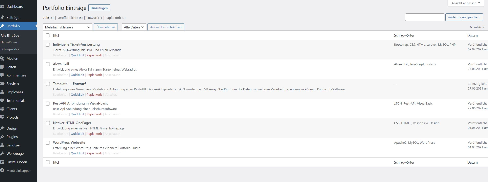
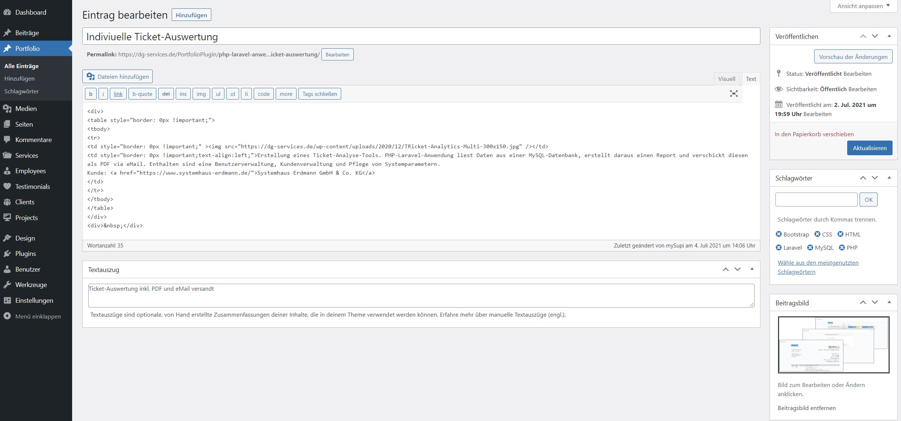
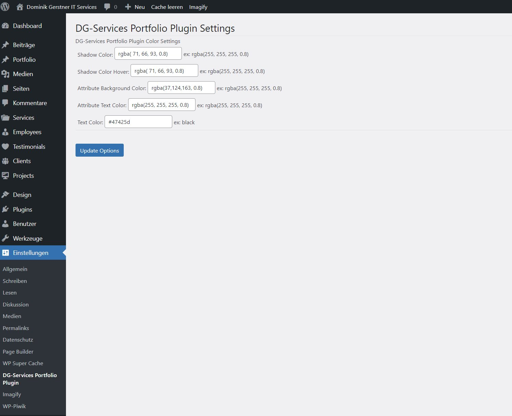
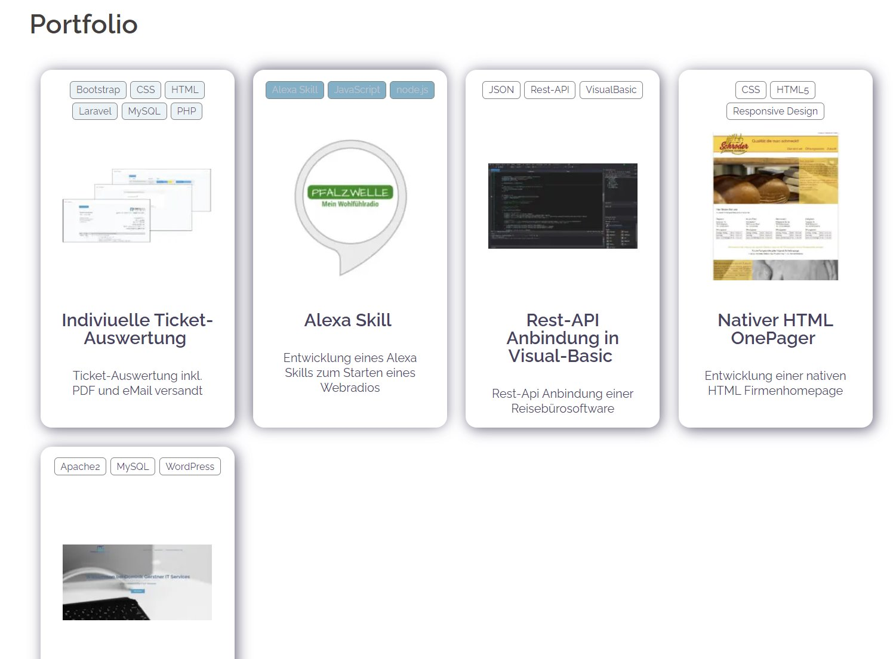
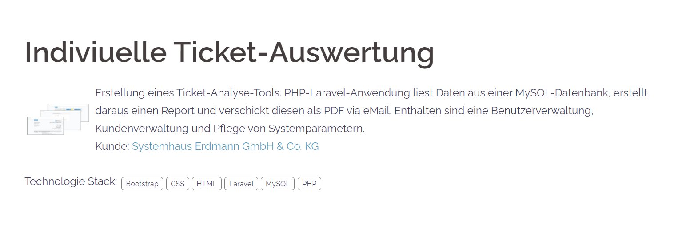

# This is a WordPress Plugin : wp_plugin_dg-services-portfolio
Its purpos is to make it possible to maintain your portfolio as a custom data type within the WordPress admin area. 

## Administration Overview

## Administration Detail

## Plugin-Configuration
The plugin also comes with the posibilty to change some colors like shadow coler, font color, etc.

After putting in the data for your portfolio you can let the portfolio display on your WordPress-Site.
Use the Shortcode `[showPortfolioList]` on the desired site to display a list of your portfolio

## Portfolio Overview

## Portfolio Detail

